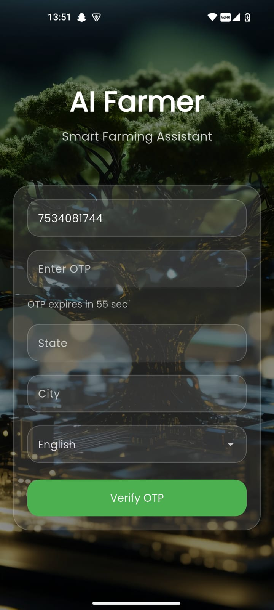
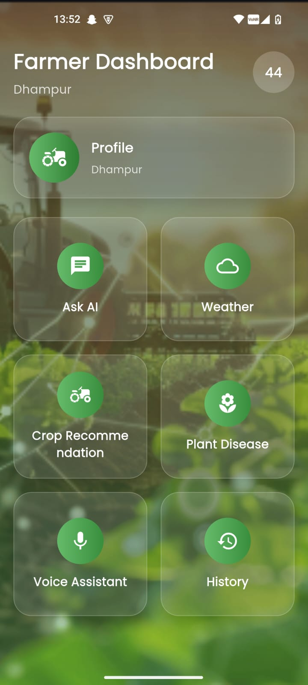
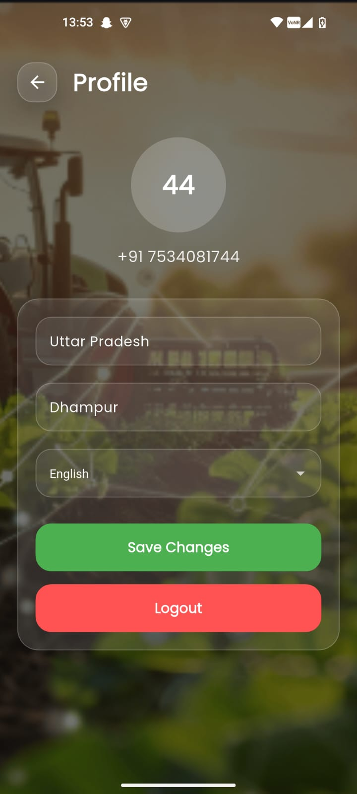
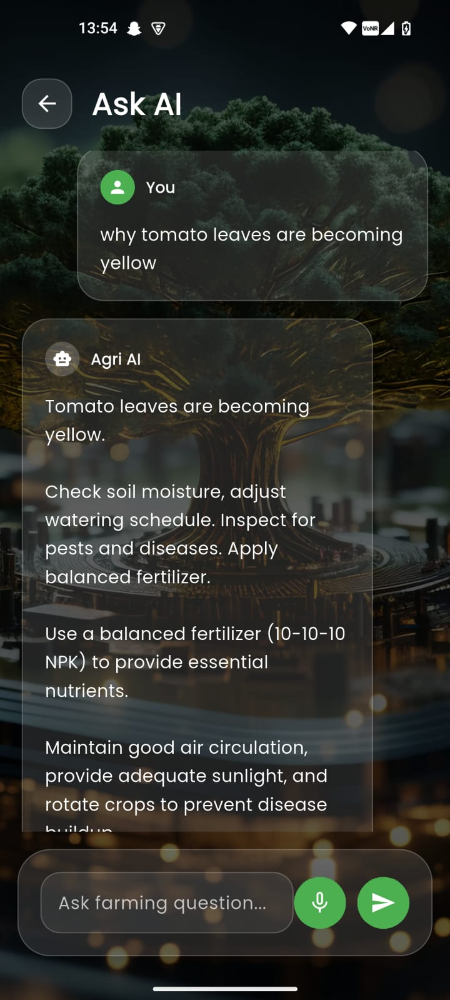
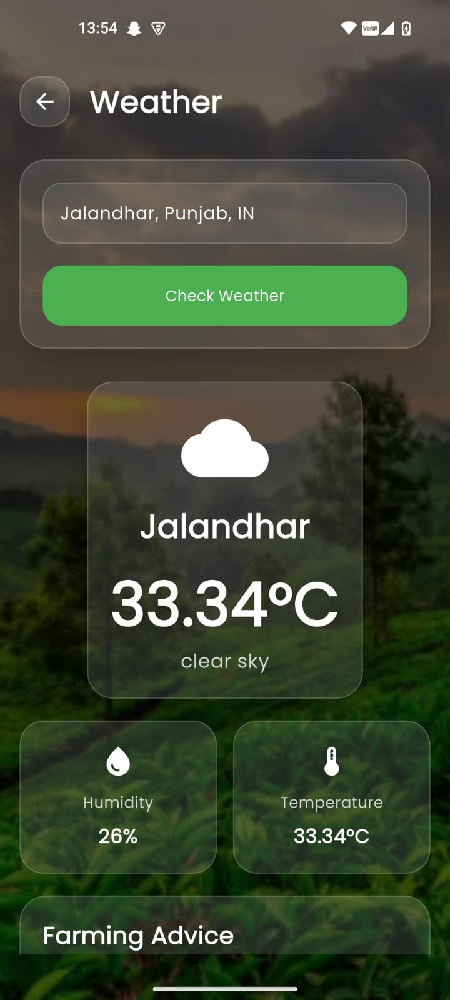
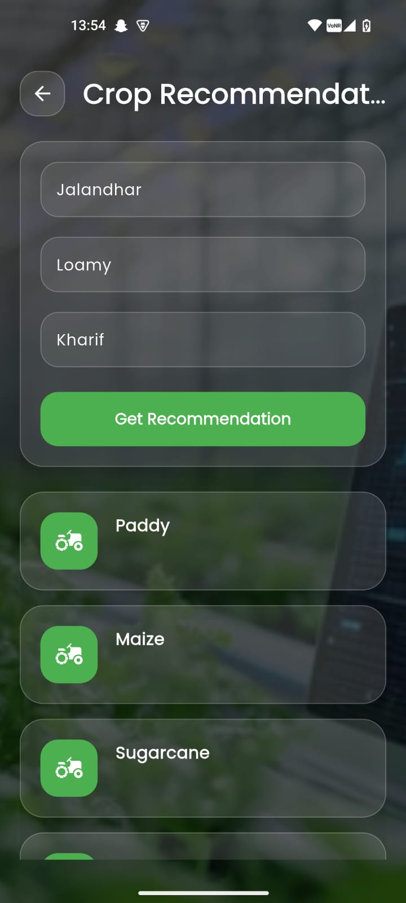
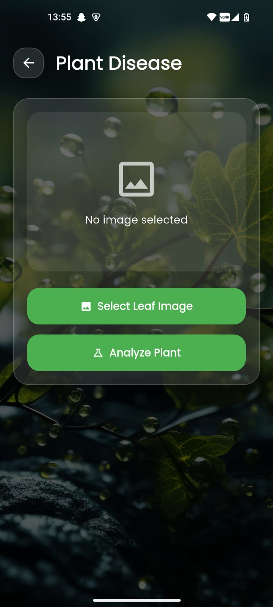
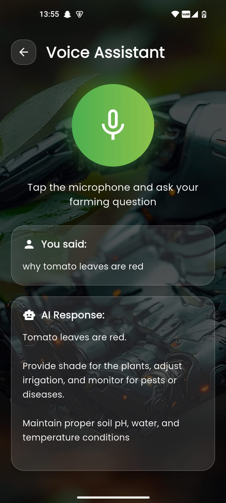

# AI Farmer Advisory System — AI-Based Multilingual Smart Farming Platform

An AI-powered agriculture advisory platform that helps farmers with crop guidance, plant disease detection, weather-based recommendations, multilingual communication, and voice-based interaction.

---

# Overview

The AI Farmer Advisory System is a full-stack smart agriculture platform developed to provide real-time farming assistance using Artificial Intelligence.

The system combines:
- Natural Language Processing (NLP)
- Computer Vision
- Speech Processing
- Weather Intelligence
- Multilingual AI Interaction

into a single integrated mobile application.

The platform enables farmers to:
- Ask farming-related questions
- Detect crop diseases using images
- Receive crop recommendations
- Get weather-based farming advice
- Use voice-based interaction
- Access services in regional languages

---

# Research Background

This project is based on the research work:

**"AI-Based Multilingual Farmer Advisory System with Disease Detection"**

The research identifies major agricultural challenges such as:
- Lack of real-time advisory services
- Limited accessibility in rural regions
- Language barriers
- Delayed plant disease detection
- Absence of integrated agricultural AI systems

The proposed solution integrates multiple AI technologies into one scalable and mobile-first platform.

---

# Problem Statement

Farmers in rural and remote areas often face:

- Limited access to agricultural experts
- Difficulty identifying plant diseases
- Lack of personalized farming recommendations
- Language barriers in digital platforms
- Poor understanding of weather impact on crops
- Low accessibility for non-technical users

Most existing agricultural systems focus only on a single functionality such as:
- Disease detection
- Chatbot assistance
- Weather information

without providing a complete AI-powered ecosystem.

---

# Proposed Solution

The AI Farmer Advisory System solves these challenges through:

- AI-powered farming consultation
- Smart crop recommendation system
- Plant disease detection using computer vision
- Voice-based farmer interaction
- Multilingual advisory system
- Real-time weather advisory
- Mobile-first user experience

The platform is designed specifically for accessibility, usability, and scalability in real-world agricultural environments.

---

# Key Features

## AI Farming Chat Assistant

- AI-powered agriculture advisory
- Personalized farming guidance
- Fertilizer recommendations
- Pesticide recommendations
- Disease prevention suggestions
- Structured AI-generated responses

---

## Plant Disease Detection

- Upload crop or leaf images
- AI-based disease identification
- Cause analysis
- Treatment suggestions
- Prevention recommendations

---

## Voice Assistant

- Speech-to-text query processing
- AI-generated voice responses
- Hands-free interaction
- Native language support

---

## Weather Advisory System

- Real-time weather information
- Temperature tracking
- Humidity monitoring
- Smart farming recommendations
- Weather-based crop guidance

---

## Crop Recommendation System

Suggests suitable crops based on:
- Location
- Soil type
- Farming season

---

## Multilingual Support

Supports multiple regional languages:
- English
- Hindi
- Punjabi
- Telugu
- Malayalam

The system generates responses in the farmer’s selected language.

---

## Query History

- Stores previous AI interactions
- Access old farming consultations
- Improves user experience

---

## Farmer Profile Management

- OTP-based authentication
- Personalized settings
- Saved language preferences
- Location-based customization

---

# System Architecture

```text
Flutter Mobile Application
            ↓
     Node.js Backend API
            ↓
        MongoDB Database
            ↓
      AI Processing Layer
   ├── Groq AI (LLM Advisory)
   ├── OpenAI GPT-4o (Vision)
   └── Weather API Integration
            ↓
      Farmer Advisory Output
```

---

# Project Structure

```text
.
├── backend/
│
│   ├── config/
│   │   └── db.js
│   │
│   ├── controllers/
│   │   ├── aiController.js
│   │   ├── authController.js
│   │   ├── cropController.js
│   │   ├── farmerController.js
│   │   ├── plantController.js
│   │   └── weatherController.js
│   │
│   ├── middleware/
│   │   └── upload.js
│   │
│   ├── models/
│   │   ├── Farmer.js
│   │   └── Query.js
│   │
│   ├── routes/
│   │   ├── aiRoutes.js
│   │   ├── authRoutes.js
│   │   ├── cityRoutes.js
│   │   ├── cropRoutes.js
│   │   ├── farmerRoutes.js
│   │   ├── historyRoutes.js
│   │   ├── plantRoutes.js
│   │   └── weatherRoutes.js
│   │
│   ├── uploads/
│   ├── .env
│   ├── package.json
│   └── server.js
│
├── farmer_app/
│
│   ├── lib/
│   │
│   │   ├── screens/
│   │   │   ├── chat_screen.dart
│   │   │   ├── crop_recommendation_screen.dart
│   │   │   ├── dashboard_screen.dart
│   │   │   ├── history_screen.dart
│   │   │   ├── login_screen.dart
│   │   │   ├── plant_disease_screen.dart
│   │   │   ├── profile_screen.dart
│   │   │   ├── voice_assistant_screen.dart
│   │   │   └── weather_screen.dart
│   │   │
│   │   ├── services/
│   │   │   ├── language_service.dart
│   │   │   └── translation_service.dart
│   │   │
│   │   ├── widgets/
│   │   │   ├── glass_card.dart
│   │   │   └── glass_container.dart
│   │   │
│   │   ├── firebase_options.dart
│   │   └── main.dart
│   │
│   ├── assets/images/
│   ├── android/
│   ├── ios/
│   ├── web/
│   └── pubspec.yaml
│
├── assets
├── README.md
└── .gitignore
```

---

# Application Screenshots

| Login Screen | Dashboard |
|----------------|-------------------|
|  |  |

| User Profile | AI-Chatbot |
|------------------|-------------------|
|  |  |

| Weather Info | Crop Recommendation |
|------------------|-------------------|
|  |  |

| Disease Detection | Voice-Assistant |
|------------------|-------------------|
|  |  |

---

# Application Screens

- Login Screen
- Dashboard Screen
- AI Chat Screen
- Voice Assistant Screen
- Weather Advisory Screen
- Crop Recommendation Screen
- Plant Disease Detection Screen
- Profile Screen
- Query History Screen

---

# Technology Stack

## Frontend (Mobile Application)

- Flutter
- Dart
- Firebase Authentication

---

## Backend

- Node.js
- Express.js
- MongoDB
- Mongoose

---

## Artificial Intelligence & APIs

- Groq API
- OpenAI GPT-4o
- OpenWeather API

---

## Authentication

- Firebase Phone Authentication

---

## UI/UX

- Glassmorphism Design
- Animate_do
- Google Fonts
- Flutter Animate

---

# APIs Used

| API | Purpose |
|------|----------|
| Groq API | AI farming advisory |
| OpenAI GPT-4o | Plant disease detection |
| OpenWeather API | Weather forecasting |
| Firebase Authentication | OTP login |

---

# Backend API Endpoints

| Endpoint | Method | Description |
|----------|---------|-------------|
| `/api/ask-ai` | POST | AI farming consultation |
| `/api/crop-recommendation` | POST | Smart crop recommendation |
| `/api/analyze-plant` | POST | Plant disease detection |
| `/api/weather` | GET | Weather advisory |
| `/api/history` | GET | Query history |
| `/api/auth/login` | POST | Farmer login |

---

# System Workflow

## AI Chat Workflow

1. Farmer submits question
2. Backend processes query
3. Groq AI generates response
4. Structured farming advice returned
5. Response displayed in selected language

---

## Plant Disease Workflow

1. Farmer uploads crop image
2. Backend processes image
3. OpenAI GPT-4o analyzes disease
4. AI generates diagnosis
5. Results shown in app

---

## Voice Assistant Workflow

1. Farmer speaks query
2. Speech converted to text
3. AI processes query
4. Response converted to speech
5. Audio response played

---

## Weather Advisory Workflow

1. Farmer enters city
2. Weather API fetches data
3. Backend analyzes conditions
4. Farming recommendations generated

---

# Installation & Setup

## Clone Repository

```bash
git clone https://github.com/Rachit753/AI-Farmer-Advisory-System.git

cd AI-Farmer-Advisory-System
```

---

## Backend Setup

```bash
cd backend

npm install

npm run dev
```

---

### Create Backend Environment File

Create `.env`

```env
MONGO_URI=your_mongodb_connection

PORT=5000

GROQ_API_KEY=your_groq_api_key

OPENAI_API_KEY=your_openai_api_key

WEATHER_API_KEY=your_openweather_api_key
```

---

## Flutter Application Setup

```bash
cd farmer_app

flutter pub get

flutter run
```

---

## Firebase Setup

1. Create Firebase Project
2. Enable Phone Authentication
3. Add Android/iOS applications
4. Configure FlutterFire
5. Download Firebase configuration
6. Run application

---

# Functional Modules

| Module | Description |
|--------|-------------|
| AI Chatbot | AI-powered farming consultation |
| Plant Disease Detection | AI image-based disease analysis |
| Voice Assistant | Speech interaction |
| Weather Advisory | Real-time farming advice |
| Crop Recommendation | Smart crop prediction |
| Multilingual System | Regional language support |
| User History | Query tracking |

---

# Research Contributions

The project contributes by:

- Integrating multiple AI technologies into one platform
- Providing multilingual farmer accessibility
- Supporting voice-based interaction
- Combining NLP + Computer Vision + Weather Intelligence
- Creating a mobile-first smart agriculture ecosystem

---

# Advantages of the System

- Real-time AI advisory
- Mobile-first architecture
- Multiple input support (text, voice, image)
- Personalized farmer guidance
- Structured AI responses
- Multilingual accessibility
- Scalable backend architecture

---

# Current Limitations

- Requires internet connection
- External AI API dependency
- Limited offline support
- Weather dependency on third-party APIs
- AI accuracy may vary in rare crop diseases

---

# Future Improvements

- Offline AI advisory support
- IoT sensor integration
- Satellite crop monitoring
- Advanced crop yield prediction
- Pest outbreak prediction
- Government scheme integration
- Marketplace integration
- AI-powered fertilizer prediction
- Real-time farmer community support

---

# Security Features

- Firebase OTP authentication
- Secure API communication
- Environment variable protection
- File upload handling using Multer
- MongoDB-based secure data storage

---

# Author

Rachit Chauhan

School of Computer Science and Engineering  
Lovely Professional University  
Phagwara, Punjab, India

---

# Why This Project?

Most agriculture applications provide static information.

AI Farmer Advisory System provides:
- Intelligent AI interaction
- Voice-based assistance
- Smart disease detection
- Personalized crop guidance
- Real-time farming support
- Multilingual accessibility

The goal is to make modern AI-powered agriculture accessible to every farmer.